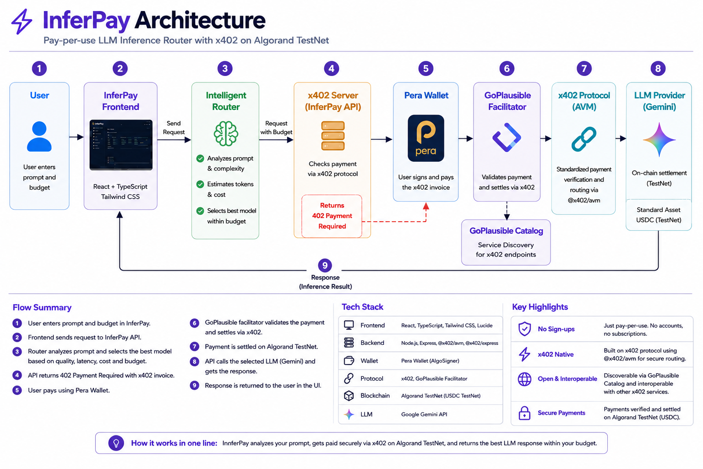

# InferPay

InferPay is a pay per request LLM inference service built using x402 and Algorand.

It allows AI agents and applications to access LLM inference without managing subscriptions, credits or separate billing systems. An agent sends a request to InferPay, receives HTTP 402, automatically completes the x402 payment and receives the routed LLM response.

InferPay also provides a web interface where users can test the service and monitor routing, payments, transactions and usage.

## Why InferPay

AI agents increasingly need to use external services such as LLM inference.

Traditional APIs usually require accounts, API keys, prepaid credits or subscriptions. This creates friction when an autonomous agent simply needs to use a service once.

InferPay makes inference directly payable per request.

An agent can request inference, handle the x402 payment and receive the result without creating an InferPay account or maintaining a subscription.

## How it works

```text
AI Agent / Application
        ↓
Discovers InferPay
        ↓
POST /api/inference
        ↓
InferPay analyzes the request
        ↓
Router selects a suitable model
        ↓
HTTP 402 Payment Required
        ↓
x402 client signs the payment
        ↓
GoPlausible verifies and settles it
        ↓
USDC settles on Algorand TestNet
        ↓
Selected LLM runs inference
        ↓
Response is returned to the agent
```

InferPay also includes a web interface using Pera Wallet for manually testing the same x402 inference service.

## Architecture

InferPay combines machine to machine x402 payments, intelligent LLM routing and Algorand settlement in one inference API.



## Agent to Agent Demo

InferPay can also be used directly by an automated client without opening the web UI.

Run:

```bash
npm run agent-demo -- "Explain x402 in one sentence"
```

The agent receives HTTP 402, signs the x402 payment using its TestNet wallet, settles through GoPlausible on Algorand TestNet and receives the routed LLM response automatically.

This demonstrates the machine to machine use case of x402 while the web interface acts as a dashboard to monitor routing, usage and payments.

## What InferPay does

- Provides a paid inference API for AI agents and applications
- Routes prompts based on task and complexity
- Considers budget and priority
- Uses real LLM responses
- Uses x402 for machine to machine pay per request payments
- Supports automatic agent payments
- Supports Pera Wallet for the web demo
- Settles USDC payments on Algorand TestNet
- Uses the GoPlausible facilitator
- Stores inference and payment history
- Shows token usage and cost
- Stores the Algorand transaction ID
- Lets transactions be verified in Lora
- Supports x402 Bazaar discovery

## x402 inference endpoint

InferPay has a public paid API

```text
POST https://inferpay-api.onrender.com/api/inference
```

Example request

```json
{
  "prompt": "Explain x402 in simple terms",
  "priority": "balanced",
  "budget": 0.01
}
```

The inference costs

```text
$0.01 USDC
```

If there is no payment the API returns

```text
402 Payment Required
```

The x402 client handles the payment and retries the protected request with payment proof.

Automated clients can sign the payment directly using their own wallet. The InferPay web demo also supports manual approval through Pera Wallet.

After the payment is verified the inference runs and the response is returned.

## x402 discovery

InferPay also supports x402 Bazaar discovery.

The 402 response contains Bazaar metadata about the inference API including the request format and example response.

InferPay can be discovered in the GoPlausible x402 TestNet resource catalog.

Public metadata is also available at

```text
https://inferpay-api.onrender.com/.well-known/x402
```

and

```text
https://inferpay-api.onrender.com/llms.txt
```
## Algorand TestNet Transaction Proof

InferPay does not deploy a custom smart contract. The x402 payment is settled on Algorand TestNet through the GoPlausible facilitator.

Successful x402 transaction:

**Transaction ID:** `2JTSD7RLIU3IG5IXBKZP6YWDMC25U5CZKJF2ATTJQV2GT5QZYTUQ`

**Lora:** [View transaction on Algorand TestNet](https://lora.algokit.io/testnet/transaction/2JTSD7RLIU3IG5IXBKZP6YWDMC25U5CZKJF2ATTJQV2GT5QZYTUQ)

## What makes InferPay different

InferPay combines intelligent LLM routing with machine to machine payments.

Instead of requiring an AI agent to maintain an InferPay subscription or prepaid account, inference is exposed as an x402 protected resource that can be paid for when needed.

Before inference, the router analyzes the task type, complexity, token estimate, budget and priority to select a suitable model tier.

This gives agents a single payable inference endpoint while InferPay handles routing behind the service.

The same API can also be discovered by other applications and AI agents through x402 discovery metadata.

In the future the same approach can be extended from LLM inference to MCP tools and other paid machine services.

## Tech used

Frontend

```text
React
TypeScript
Vite
Tailwind CSS
```

Backend

```text
Node.js
Express
TypeScript
```

AI

```text
Google Gemini
Custom routing logic
```

Payments

```text
x402
Algorand
USDC
Pera Wallet
GoPlausible Facilitator
```

Deployment

```text
Render
GitHub
```

## Run locally

Clone the project

```bash
git clone https://github.com/prabhanjanabhiram3-dotcom/InferPay.git
cd InferPay
```

Install packages

```bash
npm install
```

Create a `.env` file and add the required API and payment configuration.

For local frontend development

```env
VITE_API_BASE_URL=http://localhost:3001
```

Start the backend

```bash
npm run server
```

Start the frontend in another terminal

```bash
npm run dev
```

## Demo flow

### Machine to machine

```text
Run InferPay agent client
        ↓
Agent requests inference
        ↓
HTTP 402 Payment Required
        ↓
Agent automatically signs x402 payment
        ↓
GoPlausible verifies the payment
        ↓
Payment settles on Algorand TestNet
        ↓
InferPay routes the request
        ↓
Agent receives the LLM response
```

### Web demo

The web interface also allows a user to connect Pera Wallet, submit an inference request, approve the x402 payment and inspect the resulting transaction and usage data.

## Current status

InferPay currently works on Algorand TestNet.

The machine to machine flow from HTTP 402 to automatic x402 payment, settlement and AI response is working.

A separate web interface using Pera Wallet is also available for manually testing and monitoring the inference service.

The inference API is publicly deployed and discoverable through the x402 Bazaar system.

## Team

InferPay was built for the x402 Global Challenge – Bengaluru PreHack by:

- **Prabhanjan**
- **Pranava G Krishna**
- **Rathan U C**

## Next step

The next planned feature is MCP tool routing.

This would allow AI agents to discover external tools, pay for individual tool calls using x402 and use the result without needing separate subscriptions for every service.